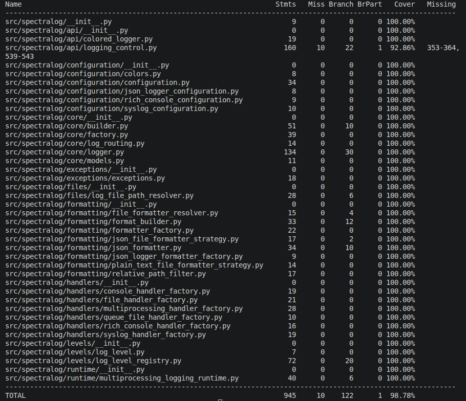

# SpectraLog

[](https://github.com/AdnanEkici/Spectralog/actions/workflows/ci.yml)
[](https://www.python.org/)
[](https://github.com/AdnanEkici/Spectralog)
[](LICENSE)
[](https://adnanekici.github.io/spectralog/)


**SpectraLog** is a configurable Python logging package built on top of Python's standard-library `logging` module.

It provides a compact application-facing API while supporting advanced logging scenarios such as:

- colored console output;
- rotating file logging;
- structured JSON Lines logging;
- Rich console integration;
- syslog forwarding;
- custom runtime log levels;
- queue-based multiprocessing-safe file logging;
- relative source paths and line numbers;
- process-local singleton logger management;
- deterministic runtime shutdown;
- test-time logging suppression;
- static typing.

Basic usage:

```python
from spectralog import CreateSpectraLogger

logger = CreateSpectraLogger()

logger.info("Application started")
logger.warning("Something needs attention")
logger.error("Something went wrong")
```

Initialize SpectraLog once when your application starts, then retrieve the same logger elsewhere with:

```python
from spectralog import get_logger

logger = get_logger()

logger.info("Processing request")
```

For most applications, `CreateSpectraLogger()` and `get_logger()` are all you need to get started.


## Documentation

Full documentation:

https://adnanekici.github.io/spectralog/

Source repository:

https://github.com/AdnanEkici/Spectralog

Issue tracker:

https://github.com/AdnanEkici/Spectralog/issues


## Table of Contents

- [Features](#features)
- [Requirements](#requirements)
- [Installation](#installation)
- [Quick Start](#quick-start)
- [Core API](#core-api)
- [Logger Lifecycle](#logger-lifecycle)
- [Standard Logging Methods](#standard-logging-methods)
- [Deferred Message Formatting](#deferred-message-formatting)
- [Debug Logging](#debug-logging)
- [File Logging](#file-logging)
- [Daily Log Files](#daily-log-files)
- [Log Rotation](#log-rotation)
- [Source Path and Line Information](#source-path-and-line-information)
- [Custom Console and File Formats](#custom-console-and-file-formats)
- [JSON Logging](#json-logging)
- [Rich Console Logging](#rich-console-logging)
- [Syslog Logging](#syslog-logging)
- [Custom Log Levels](#custom-log-levels)
- [Generic Log Method](#generic-log-method)
- [Multiprocessing-Safe File Logging](#multiprocessing-safe-file-logging)
- [Disabling Logging During Tests](#disabling-logging-during-tests)
- [Exception Handling](#exception-handling)
- [Configuration Reference](#configuration-reference)
- [Architecture](#architecture)
- [Thread Safety and Process Behavior](#thread-safety-and-process-behavior)
- [Shutdown](#shutdown)
- [Type Checking](#type-checking)
- [Development](#development)
- [Testing](#testing)
- [Documentation Development](#documentation-development)
- [Building the Package](#building-the-package)
- [Project Structure](#project-structure)
- [Design Goals](#design-goals)
- [Known Behavioral Boundaries](#known-behavioral-boundaries)
- [Versioning](#versioning)
- [License](#license)


## Features

- **Python 3.10+ support**
- **Version 1.0.0**
- **Typed package** with `py.typed`
- **Colored console logging**
- **Standard DEBUG, INFO, WARNING, ERROR, and CRITICAL levels**
- **Custom runtime log levels**
- **Custom log-level colors**
- **Rotating file logging**
- **Configurable maximum file size**
- **Configurable backup count**
- **Automatic daily log file names**
- **Custom log file names**
- **Custom log directories**
- **Structured JSON Lines (`.jsonl`) logging**
- **Configurable JSON metadata**
- **Exception serialization in JSON logs**
- **Unicode-safe JSON output**
- **Rich console integration**
- **Rich traceback rendering**
- **Optional Rich markup**
- **Syslog support**
- **UDP syslog support**
- **TCP syslog support**
- **Configurable syslog facility**
- **Relative source-path logging**
- **Source line-number logging**
- **Custom console formats**
- **Custom file formats**
- **Custom date formats**
- **Queue-based multiprocessing-safe file logging**
- **Deterministic multiprocessing runtime shutdown**
- **Thread-safe singleton initialization**
- **Thread-safe custom log-level registration**
- **Process-local application logger singleton**
- **Explicit logger shutdown**
- **Automatic `atexit` cleanup**
- **`unittest` logging suppression decorator**
- **Per-test singleton isolation**
- **Sphinx documentation**
- **Unit and integration test coverage**

## Requirements

SpectraLog supports:

```text
Python >= 3.10
```

The package is intended to support:

- Python 3.10
- Python 3.11
- Python 3.12
- Python 3.13
- newer compatible Python 3 releases

The main runtime dependencies are:

- `colorlog`
- `rich`

Documentation tooling such as Sphinx and Furo is not required by applications that install SpectraLog.


## Installation

### Install from PyPI

Once SpectraLog is published to PyPI:

```bash
python -m pip install spectralog
```

Verify the installation:

```python
import spectralog
```


### Install Directly from GitHub

```bash
python -m pip install git+https://github.com/AdnanEkici/Spectralog.git
```


### Install from Source

Clone the repository:

```bash
git clone https://github.com/AdnanEkici/Spectralog.git
cd Spectralog
```

Install the package in editable mode:

```bash
python -m pip install -e .
```

Install development dependencies:

```bash
python -m pip install -e ".[dev]"
```

Install documentation dependencies:

```bash
python -m pip install -e ".[docs]"
```

Install both:

```bash
python -m pip install -e ".[dev,docs]"
```


## Quick Start

Initialize SpectraLog once near the entry point of your application:

```python
from spectralog import CreateSpectraLogger


logger = CreateSpectraLogger()

logger.info("Application started")
logger.warning("Configuration requires attention")
logger.error("Example error")
```

By default, SpectraLog:

- uses `INFO` as the effective logging level;
- writes output to the console;
- includes timestamps in generated plain-text formats;
- enables persistent file logging;
- writes log files beneath the `logs` directory;
- creates a daily log file when no custom file name is supplied;
- uses rotating file logging;
- does not enable JSON logging;
- does not enable Rich console output;
- does not enable syslog;
- does not enable multiprocessing-safe file logging.


## Core API

The main public logger API is:

```python
from spectralog import CreateSpectraLogger
from spectralog import get_logger
```

Optional configuration classes include:

```python
from spectralog import JsonLoggerConfiguration
from spectralog import RichConsoleConfiguration
from spectralog import SyslogConfiguration
```

For test suites:

```python
from spectralog import disable_application_logging
```


## Logger Lifecycle

SpectraLog uses a **process-local application logger singleton**.

The normal lifecycle is:

```text
Application startup
       |
       v
CreateSpectraLogger(...)
       |
       v
ApplicationLogger singleton
       |
       +--------------------------+
       |                          |
       v                          v
logger.info(...)             get_logger()
                                  |
                                  v
                        same ApplicationLogger
```

Initialize SpectraLog once:

```python
from spectralog import CreateSpectraLogger


logger = CreateSpectraLogger(
    debug_mode=True,
    log_file_name="application.log",
)
```

Then retrieve the same logger elsewhere:

```python
from spectralog import get_logger


logger = get_logger()
logger.info("Processing request")
```

Repeated calls to:

```python
get_logger()
```

return the same `ApplicationLogger` instance within the current Python process.


### Reconfiguration

After explicit initialization, calling `CreateSpectraLogger` again with configuration arguments is considered a reconfiguration attempt.

For example:

```python
CreateSpectraLogger(
    debug_mode=True,
)

CreateSpectraLogger(
    debug_mode=False,
)
```

The second explicit initialization is rejected.

This prevents ambiguous application-wide logging state such as:

- competing file destinations;
- conflicting logging levels;
- different formatter configurations;
- multiple handler sets;
- multiple multiprocessing runtimes;
- different custom log-level registries;
- unclear shutdown ownership.

The recommended pattern is:

```python
CreateSpectraLogger(...)
```

once, followed by:

```python
get_logger()
```

throughout the rest of the process.


## Standard Logging Methods

SpectraLog provides wrappers around the standard Python logging methods.

### Debug

```python
logger.debug("Debug message")
```

### Info

```python
logger.info("Informational message")
```

### Warning

```python
logger.warning("Warning message")
```

### Error

```python
logger.error("Error message")
```

### Critical

```python
logger.critical("Critical message")
```

### Exception

Use `exception` inside an active exception handler:

```python
try:
    result = 10 / 0
except ZeroDivisionError:
    logger.exception("Calculation failed")
```

The active exception information is forwarded through Python's logging system.


## Deferred Message Formatting

SpectraLog preserves standard Python logging interpolation.

Instead of:

```python
logger.info(
    f"User {user_name} authenticated",
)
```

you may use:

```python
logger.info(
    "User %s authenticated",
    user_name,
)
```

Multiple values are supported:

```python
logger.info(
    "Processed %d records in %s",
    record_count,
    duration,
)
```

The positional arguments are forwarded to the underlying logger.

This keeps message formatting deferred until the logging system determines whether the record should be emitted.


## Debug Logging

Debug logging is disabled by default:

```python
logger = CreateSpectraLogger(
    debug_mode=False,
)
```

The effective logging level is:

```text
INFO
```

Enable debug logging with:

```python
logger = CreateSpectraLogger(
    debug_mode=True,
)
```

The effective logging level becomes:

```text
DEBUG
```

Then DEBUG records can be emitted:

```python
logger.debug(
    "Detailed diagnostic information",
)
```


## File Logging

Persistent file logging is enabled by default:

```python
logger = CreateSpectraLogger(
    save_logs=True,
)
```

The default directory is:

```text
logs/
```

A custom directory may be supplied as a string:

```python
logger = CreateSpectraLogger(
    logs_directory="application_logs",
)
```

or as a `pathlib.Path`:

```python
from pathlib import Path

from spectralog import CreateSpectraLogger


logger = CreateSpectraLogger(
    logs_directory=Path("application_logs"),
)
```

The configured log directory is expanded and resolved before use.

When file logging is enabled, SpectraLog creates the directory when necessary.


### Disable File Logging

If only console and optional syslog output are required:

```python
logger = CreateSpectraLogger(
    save_logs=False,
)
```

No file handler is created.


### Custom Log File Name

Specify a custom file name:

```python
logger = CreateSpectraLogger(
    log_file_name="application.log",
)
```

With the default log directory, this produces:

```text
logs/application.log
```

A custom directory can be combined with a custom file name:

```python
logger = CreateSpectraLogger(
    logs_directory="application_logs",
    log_file_name="service.log",
)
```

Result:

```text
application_logs/service.log
```


## Daily Log Files

If `log_file_name` is omitted, SpectraLog generates a daily file name from the current local date.

For example:

```text
logs/2026-08-25.log
```

When JSON logging is enabled, the extension becomes:

```text
logs/2026-08-25.jsonl
```


## Log Rotation

Persistent file logging uses:

```python
logging.handlers.RotatingFileHandler
```

The default maximum active log file size is:

```text
20 MiB
```

which corresponds to:

```python
20 * (1024**2)
```

The default number of retained backup files is:

```text
1
```

Configure rotation explicitly:

```python
logger = CreateSpectraLogger(
    max_bytes=10 * 1024 * 1024,
    backup_count=5,
)
```

This configures:

```text
Maximum file size: 10 MiB
Backup files:      5
```


## Source Path and Line Information

SpectraLog can include source location information in generated plain-text log formats.

### Show Line Number

```python
logger = CreateSpectraLogger(
    show_line=True,
)
```

A generated entry can include:

```text
line 42
```


### Show Relative Source Path

```python
logger = CreateSpectraLogger(
    show_folder_name=True,
)
```

SpectraLog enriches logging records with a `relative_path` field using its relative-path filter.

If the source file is under the configured project root, the relative path is used.

For example:

```text
services/payment_service.py
```

If the source cannot be represented relative to the project root, SpectraLog falls back to the source filename.


### Show Relative Path and Line Number

```python
logger = CreateSpectraLogger(
    show_folder_name=True,
    show_line=True,
)
```

The source location can then appear as:

```text
services/payment_service.py:42
```


## Custom Console and File Formats

SpectraLog can generate formats automatically, but explicit format strings can also be supplied.

### Custom Console Format

```python
logger = CreateSpectraLogger(
    console_format="%(levelname)s | %(message)s",
)
```

When `console_format` is provided, it replaces SpectraLog's automatically generated console format.


### Custom File Format

```python
logger = CreateSpectraLogger(
    file_format="%(asctime)s | %(levelname)s | %(message)s",
)
```

When supplied, `file_format` replaces the automatically generated plain-text file format.


### Date Format

The default date format is:

```text
%Y-%m-%d %H:%M:%S
```

Customize it:

```python
logger = CreateSpectraLogger(
    date_format="%d/%m/%Y %H:%M:%S",
)
```


## JSON Logging

SpectraLog supports structured JSON Lines file logging.

Import the JSON configuration:

```python
from spectralog import CreateSpectraLogger
from spectralog import JsonLoggerConfiguration
```

Enable JSON logging:

```python
logger = CreateSpectraLogger(
    log_file_name="application.log",
    json_logger_configuration=JsonLoggerConfiguration(),
)
```

When JSON logging is enabled, SpectraLog uses the `.jsonl` extension.

The example above therefore writes:

```text
logs/application.jsonl
```

instead of:

```text
logs/application.log
```


### JSON Lines Format

SpectraLog emits one complete JSON object per line.

Example:

```json
{"level": "INFO", "message": "Application started"}
{"level": "WARNING", "message": "Disk usage is high"}
{"level": "ERROR", "message": "Operation failed"}
```

JSON Lines works well for:

- log aggregation;
- observability tooling;
- structured querying;
- command-line processing;
- data pipelines;
- log ingestion services.


### Default JSON Configuration

```python
JsonLoggerConfiguration(
    include_timestamp=True,
    include_logger_name=True,
    include_process_information=True,
    include_thread_information=True,
)
```

Every JSON record always contains:

```text
level
message
```

Depending on configuration, it may additionally contain:

```text
timestamp
logger
process_id
process_name
thread_id
thread_name
exception
```


### Example JSON Record

A log entry may resemble:

```json
{
  "level": "INFO",
  "message": "Application started",
  "timestamp": "2026-08-25T14:30:00+00:00",
  "logger": "ApplicationLogger",
  "process_id": 12345,
  "process_name": "MainProcess",
  "thread_id": 139999999999999,
  "thread_name": "MainThread"
}
```

Process and thread identifiers naturally vary between executions.


### Disable Optional JSON Fields

```python
json_configuration = JsonLoggerConfiguration(
    include_timestamp=True,
    include_logger_name=False,
    include_process_information=False,
    include_thread_information=False,
)

logger = CreateSpectraLogger(
    json_logger_configuration=json_configuration,
)
```

`level` and `message` remain present.


### JSON Exception Logging

Exception information is automatically included when the logging record contains exception data.

```python
try:
    raise RuntimeError("Operation failed")
except RuntimeError:
    logger.exception(
        "Unable to complete operation",
    )
```

The generated JSON record includes an:

```text
exception
```

field containing formatted exception information.


### Unicode JSON Output

SpectraLog uses JSON serialization with Unicode preservation enabled.

For example:

```python
logger.info("Merhaba dünya")
logger.info("こんにちは世界")
logger.info("Привет мир")
```

Unicode text can be written directly instead of being converted solely into ASCII escape sequences.


## Rich Console Logging

SpectraLog integrates with `rich.logging.RichHandler`.

Enable Rich console output:

```python
from spectralog import CreateSpectraLogger
from spectralog import RichConsoleConfiguration


logger = CreateSpectraLogger(
    rich_console_configuration=RichConsoleConfiguration(),
)
```

When Rich configuration is supplied, SpectraLog uses a Rich handler instead of its standard colored console handler.


### Rich Configuration

The configuration object is:

```python
RichConsoleConfiguration(
    show_time=True,
    show_level=True,
    show_path=True,
    rich_tracebacks=True,
    markup=False,
)
```


### Show Time

```python
RichConsoleConfiguration(
    show_time=False,
)
```

Controls Rich's timestamp column.


### Show Level

```python
RichConsoleConfiguration(
    show_level=False,
)
```

Controls Rich's logging-level column.


### Show Path

```python
RichConsoleConfiguration(
    show_path=False,
)
```

Controls Rich's source-path display.


### Rich Tracebacks

Rich traceback rendering is enabled by default:

```python
RichConsoleConfiguration(
    rich_tracebacks=True,
)
```

Example:

```python
try:
    raise RuntimeError("Example failure")
except RuntimeError:
    logger.exception(
        "Operation failed",
    )
```


### Rich Markup

Markup is disabled by default:

```python
RichConsoleConfiguration(
    markup=False,
)
```

Enable it only when log messages intentionally use Rich markup:

```python
RichConsoleConfiguration(
    markup=True,
)
```


## Syslog Logging

SpectraLog can forward log records to a syslog server.

Basic example:

```python
import socket

from spectralog import CreateSpectraLogger
from spectralog import SyslogConfiguration


logger = CreateSpectraLogger(
    syslog_configuration=SyslogConfiguration(
        host="localhost",
        port=514,
        socket_type=socket.SOCK_DGRAM,
    ),
)

logger.info(
    "Application started",
)
```


### Syslog Configuration

Defaults:

```python
SyslogConfiguration(
    host="localhost",
    port=514,
    facility=SysLogHandler.LOG_USER,
    socket_type=socket.SOCK_DGRAM,
)
```

Available configuration values are:

- destination host;
- destination port;
- syslog facility;
- socket transport.


### UDP Syslog

```python
import socket

from spectralog import CreateSpectraLogger
from spectralog import SyslogConfiguration


logger = CreateSpectraLogger(
    syslog_configuration=SyslogConfiguration(
        host="192.168.1.50",
        port=514,
        socket_type=socket.SOCK_DGRAM,
    ),
)
```


### TCP Syslog

```python
import socket

from spectralog import CreateSpectraLogger
from spectralog import SyslogConfiguration


logger = CreateSpectraLogger(
    syslog_configuration=SyslogConfiguration(
        host="logs.example.com",
        port=514,
        socket_type=socket.SOCK_STREAM,
    ),
)
```


### Combined Console, File, and Syslog Logging

```python
import socket

from spectralog import CreateSpectraLogger
from spectralog import SyslogConfiguration


logger = CreateSpectraLogger(
    logs_directory="logs",
    log_file_name="application.log",
    save_logs=True,
    syslog_configuration=SyslogConfiguration(
        host="localhost",
        port=514,
        socket_type=socket.SOCK_DGRAM,
    ),
)

logger.warning(
    "Configuration changed",
)
```

A single record can therefore be emitted through multiple destinations:

```text
ApplicationLogger
      |
      +--> Console
      |
      +--> File
      |
      +--> Syslog
```


## Custom Log Levels

SpectraLog supports custom log levels registered at runtime.

Register a custom level:

```python
logger.add_log_level(
    name="NOTICE",
    color="cyan",
    severity=35,
)
```

After registration:

```python
logger.notice(
    "Deployment completed",
)
```

The custom level is also available through the generic logging method:

```python
logger.log(
    "NOTICE",
    "Deployment completed",
)
```


### Custom Level Name Normalization

Names are normalized by:

1. stripping surrounding whitespace;
2. converting the result to uppercase.

For example:

```python
logger.add_log_level(
    name="audit_event",
    color="cyan",
    severity=35,
)
```

is stored as:

```text
AUDIT_EVENT
```

and can be accessed dynamically as:

```python
logger.audit_event(
    "User permissions changed",
)
```


### Custom Level Naming Rules

A custom log-level name must:

- not be empty;
- begin with a letter;
- contain only letters, numbers, and underscores.

The normalized validation pattern is:

```text
^[A-Z][A-Z0-9_]*$
```

Valid examples:

```text
NOTICE
AUDIT
AUDIT_EVENT
LEVEL2
SECURITY_EVENT
```


### Severity Rules

A custom severity must:

- be an integer;
- not be a boolean value;
- be greater than zero;
- not duplicate a severity already assigned in the registry.

Example:

```python
logger.add_log_level(
    name="NOTICE",
    color="cyan",
    severity=35,
)
```


### Color Rules

Custom colors must be supported by `colorlog`.

Example:

```python
logger.add_log_level(
    name="NOTICE",
    color="cyan",
    severity=35,
)
```

After registration, compatible colored formatters are refreshed so the custom level can use the new color immediately.


## Generic Log Method

SpectraLog provides:

```python
logger.log(...)
```

The `level` argument may be:

- a registered level name;
- an integer severity.

By name:

```python
logger.log(
    "WARNING",
    "Disk usage is high",
)
```

By integer severity:

```python
logger.log(
    30,
    "Disk usage is high",
)
```

With a custom level:

```python
logger.add_log_level(
    name="NOTICE",
    color="cyan",
    severity=35,
)

logger.log(
    "NOTICE",
    "Deployment completed",
)
```


## Multiprocessing-Safe File Logging

SpectraLog provides queue-based file logging with:

```python
logger = CreateSpectraLogger(
    multiprocessing_safe=True,
)
```

When enabled, the application logger writes file-bound records through a queue handler rather than directly through the rotating file handler.

The architecture is:

```text
ApplicationLogger
       |
       v
   QueueHandler
       |
       v
Multiprocessing Queue
       |
       v
   QueueListener
       |
       v
RotatingFileHandler
       |
       v
    Log File
```

The runtime contains:

- a multiprocessing queue;
- a `QueueHandler`;
- a `QueueListener`;
- a rotating file handler;
- lifecycle management through `MultiprocessingLoggingRuntime`.

The runtime is started automatically when the application logger is initialized.


### Multiprocessing Runtime Shutdown

During shutdown, the runtime:

1. stops the queue listener when it is running;
2. closes the queue handler;
3. closes the multiprocessing queue;
4. joins the queue feeder thread;
5. marks itself as closed.

This makes shutdown deterministic and allows queued records to be processed before resources are released.


### Important Multiprocessing Boundary

`multiprocessing_safe=True` does **not** mean that unrelated Python processes can independently initialize SpectraLog and safely rotate the same physical file.

Independent processes have separate:

- memory;
- `ApplicationLogger` singleton instances;
- queues;
- listeners;
- file handlers;
- multiprocessing runtimes.

For example:

```text
Process A
    |
    +--> Queue A
          |
          +--> Listener A
                |
                +--> FileHandler A
                      |
                      +--> shared.log


Process B
    |
    +--> Queue B
          |
          +--> Listener B
                |
                +--> FileHandler B
                      |
                      +--> shared.log
```

Those two file handlers are not automatically coordinated.

For independently initialized processes, separate log files are the safer default:

```text
Process A -> process-a.log
Process B -> process-b.log
Process C -> process-c.log
```


## Disabling Logging During Tests

SpectraLog provides:

```python
disable_application_logging
```

for `unittest.TestCase` classes that execute application code which initializes SpectraLog.

Example:

```python
import unittest

from spectralog import CreateSpectraLogger
from spectralog import disable_application_logging
from spectralog import get_logger


@disable_application_logging
class UnitTestApplication(unittest.TestCase):
    def test_application_behavior(
        self,
    ) -> None:
        """Verifies application behavior while SpectraLog output is disabled."""
        CreateSpectraLogger(
            log_file_name="application.log",
        )

        logger = get_logger()

        logger.info(
            "Application code can continue logging normally",
        )

        self.assertTrue(
            True,
            "Expected application behavior to complete successfully.",
        )
```

Application code does not need special logging branches for tests.

It can continue calling:

```python
CreateSpectraLogger(...)
get_logger()

logger.debug(...)
logger.info(...)
logger.warning(...)
logger.error(...)
logger.critical(...)
logger.exception(...)
```


### What the Test Decorator Disables

While the decorated test class is active, SpectraLog substitutes disabled logging infrastructure.

This prevents normal SpectraLog side effects such as:

- console logging output;
- file creation;
- rotating file handlers;
- Rich handlers;
- syslog handlers;
- multiprocessing logging runtimes;
- SpectraLog `atexit` registration.


### Per-Test Singleton Isolation

Each test method gets isolated `ApplicationLogger` singleton state.

Conceptually:

```text
setUpClass
    |
    +--> enable disabled logging infrastructure


test method 1
    |
    +--> setUp
    |      |
    |      +--> preserve previous singleton
    |      +--> clear singleton
    |
    +--> test
    |      |
    |      +--> CreateSpectraLogger(...)
    |      +--> get_logger()
    |
    +--> tearDown
           |
           +--> shut down test singleton
           +--> restore previous singleton


test method 2
    |
    +--> setUp
    |      |
    |      +--> preserve previous singleton
    |      +--> clear singleton
    |
    +--> test
    |
    +--> tearDown
           |
           +--> shut down test singleton
           +--> restore previous singleton


tearDownClass
    |
    +--> remove disabled logging infrastructure
```

This allows multiple test methods in one decorated class to call `CreateSpectraLogger(...)` independently.


## Exception Handling

SpectraLog provides package-specific exceptions beneath a common base exception.

The base exception is:

```text
SpectraLogError
```

The hierarchy includes logger lifecycle, registry, and validation failures.


### Application Logger Exceptions

Relevant exceptions include:

```text
SpectraApplicationLoggerAlreadyInitializedError
SpectraApplicationLoggerReconfigurationError
```

`SpectraApplicationLoggerAlreadyInitializedError` is used when the internal application logger lifecycle is bypassed through invalid direct construction.

`SpectraApplicationLoggerReconfigurationError` is used when an already initialized process-local logger is explicitly configured again.


### Log-Level Exceptions

Relevant custom-level exceptions include:

```text
SpectraLogLevelAlreadyExistsError
SpectraLogLevelNotFoundError
InvalidSpectraLogLevelNameError
InvalidSpectraLogLevelSeverityError
InvalidSpectraLogColorError
```


### Catch All SpectraLog Errors

```python
from spectralog.exceptions.exceptions import SpectraLogError


try:
    ...
except SpectraLogError as exception:
    print(
        f"SpectraLog error: {exception}",
    )
```


## Configuration Reference

The complete logger creation signature is:

```python
CreateSpectraLogger(
    debug_mode=False,
    show_datetime=True,
    show_line=False,
    show_folder_name=False,
    logs_directory="logs",
    log_file_name=None,
    save_logs=True,
    multiprocessing_safe=False,
    syslog_configuration=None,
    rich_console_configuration=None,
    json_logger_configuration=None,
    console_format=None,
    file_format=None,
    date_format="%Y-%m-%d %H:%M:%S",
    max_bytes=20 * (1024**2),
    backup_count=1,
)
```

### Main Configuration

| Parameter | Type | Default | Description |
|---|---|---|---|
| `debug_mode` | `bool` | `False` | Uses DEBUG as the effective logging level when enabled; otherwise INFO. |
| `show_datetime` | `bool` | `True` | Includes timestamps in automatically generated plain-text formats. |
| `show_line` | `bool` | `False` | Includes source line numbers in generated formats. |
| `show_folder_name` | `bool` | `False` | Includes relative source-path information in generated formats. |
| `logs_directory` | `str \| Path` | `"logs"` | Directory used for persistent log files. |
| `log_file_name` | `str \| None` | `None` | Optional custom log file name. A daily file name is generated when omitted. |
| `save_logs` | `bool` | `True` | Enables persistent file logging. |
| `multiprocessing_safe` | `bool` | `False` | Enables queue-based file logging infrastructure. |
| `syslog_configuration` | `SyslogConfiguration \| None` | `None` | Enables syslog output when supplied. |
| `rich_console_configuration` | `RichConsoleConfiguration \| None` | `None` | Enables Rich console output when supplied. |
| `json_logger_configuration` | `JsonLoggerConfiguration \| None` | `None` | Enables structured JSON Lines file logging when supplied. |
| `console_format` | `str \| None` | `None` | Explicit standard console format override. |
| `file_format` | `str \| None` | `None` | Explicit plain-text file format override. |
| `date_format` | `str` | `"%Y-%m-%d %H:%M:%S"` | Timestamp formatting string. |
| `max_bytes` | `int` | `20 * (1024**2)` | Maximum active log file size before rollover. |
| `backup_count` | `int` | `1` | Number of rotated backup files retained. |


## JSON Configuration Reference

Default JSON configuration:

```python
JsonLoggerConfiguration(
    include_timestamp=True,
    include_logger_name=True,
    include_process_information=True,
    include_thread_information=True,
)
```

| Option | Default | Description |
|---|---:|---|
| `include_timestamp` | `True` | Adds an ISO-8601 UTC timestamp. |
| `include_logger_name` | `True` | Adds the originating logger name. |
| `include_process_information` | `True` | Adds process ID and process name. |
| `include_thread_information` | `True` | Adds thread ID and thread name. |

The following fields are always included:

```text
level
message
```

Exception information is included when present in the logging record.


## Rich Configuration Reference

Default Rich configuration:

```python
RichConsoleConfiguration(
    show_time=True,
    show_level=True,
    show_path=True,
    rich_tracebacks=True,
    markup=False,
)
```

| Option | Default | Description |
|---|---:|---|
| `show_time` | `True` | Displays Rich's timestamp column. |
| `show_level` | `True` | Displays Rich's log-level column. |
| `show_path` | `True` | Displays Rich's source-path information. |
| `rich_tracebacks` | `True` | Enables Rich traceback rendering. |
| `markup` | `False` | Enables Rich markup interpretation in messages. |


## Syslog Configuration Reference

Default syslog configuration:

```python
SyslogConfiguration(
    host="localhost",
    port=514,
    facility=SysLogHandler.LOG_USER,
    socket_type=socket.SOCK_DGRAM,
)
```

| Option | Default | Description |
|---|---:|---|
| `host` | `"localhost"` | Target syslog hostname or IP address. |
| `port` | `514` | Target syslog port. |
| `facility` | `SysLogHandler.LOG_USER` | Standard syslog facility. |
| `socket_type` | `socket.SOCK_DGRAM` | Socket transport type, commonly UDP or TCP. |


## Architecture

SpectraLog separates public usage from internal construction.

High-level initialization looks like:

```text
CreateSpectraLogger
       |
       v
LoggerConfiguration
       |
       v
LogLevelRegistry
       |
       v
ApplicationLoggerBuilderFactory
       |
       v
ApplicationLoggerBuilder
       |
       +-----------------------+
       |                       |
       v                       v
Console Handler          File Logging
       |                       |
       |                 +-----+------+
       |                 |            |
       |                 v            v
       |           Direct File   Multiprocessing
       |             Handler       Runtime
       |
       +-----------------------+
       |
       v
Optional Syslog Handler
       |
       v
logging.Logger
       |
       v
ApplicationLogger
```


### ApplicationLogger

`ApplicationLogger` is the main logging facade.

It is responsible for:

- process-local singleton lifecycle;
- standard logging methods;
- dynamic custom log-level methods;
- severity resolution;
- stack-level handling;
- multiprocessing runtime startup;
- shutdown;
- new-log-file notification.


### ApplicationLoggerBuilder

`ApplicationLoggerBuilder` orchestrates construction of the underlying standard-library logger.

It:

- obtains the named logger;
- removes and closes existing handlers;
- applies the configured logging level;
- selects standard or Rich console output;
- configures file logging;
- configures multiprocessing-safe file logging;
- configures syslog;
- disables propagation;
- returns a `LoggerBuildResult`.


### ApplicationLoggerBuilderFactory

`ApplicationLoggerBuilderFactory` creates the internal dependency graph.

It composes:

- `LogFormatBuilder`;
- `RelativePathFilter`;
- `LoggerFormatterFactory`;
- `JsonLoggerFormatterFactory`;
- file formatter strategies;
- `FileFormatterResolver`;
- console handler factory;
- Rich console handler factory;
- rotating file handler factory;
- queue handler factory;
- multiprocessing handler factory;
- syslog handler factory;
- log file path resolver.


### Formatting Strategy

File formatter selection follows a strategy model:

```text
LoggerConfiguration
       |
       v
FileFormatterResolver
       |
       +--> JsonFileFormatterStrategy
       |
       +--> PlainTextFileFormatterStrategy
       |
       v
logging.Formatter
```

JSON formatting is checked before plain-text formatting.

This allows JSON configuration to take precedence when enabled.


### Handler Architecture

Handler construction is separated by responsibility:

```text
ConsoleHandlerFactory
RichConsoleHandlerFactory
FileHandlerFactory
QueueFileHandlerFactory
MultiprocessingHandlerFactory
SyslogHandlerFactory
```

This keeps individual logging destinations isolated and independently testable.


## Thread Safety and Process Behavior

### Singleton Initialization

The process-local `ApplicationLogger` singleton is protected by an internal lock.

This prevents multiple threads from independently constructing competing singleton instances during initialization.


### Custom Log-Level Registration

`LogLevelRegistry` uses a lock while checking and inserting custom levels.

This ensures duplicate-name and duplicate-severity checks remain consistent during concurrent registration attempts.


### Multiprocessing Runtime

`MultiprocessingLoggingRuntime` uses an `RLock` to protect lifecycle state.

Operations such as:

```text
start
stop
is_running
```

are synchronized.


### Process Isolation

A singleton is local to one Python process.

For example:

```text
Process A
    ApplicationLogger._instance = A

Process B
    ApplicationLogger._instance = B

Process C
    ApplicationLogger._instance = C
```

These objects do not share Python memory.

Therefore different subprocesses can independently initialize SpectraLog with different configurations and different log files.


## Shutdown

SpectraLog registers:

```python
ApplicationLogger.shutdown
```

with `atexit` during logger initialization.

This allows resources to be cleaned up during normal interpreter termination.

Shutdown can also be performed explicitly:

```python
logger.shutdown()
```

This is useful when deterministic cleanup is required.

For example:

```python
logger = CreateSpectraLogger(
    multiprocessing_safe=True,
)

try:
    logger.info(
        "Application running",
    )
finally:
    logger.shutdown()
```

`shutdown()` is idempotent.

Calling it repeatedly does not repeatedly stop or close resources.


## Type Checking

SpectraLog is designed as a typed package.

The package includes:

```text
src/spectralog/py.typed
```

which indicates that inline type information is intended to be available to downstream type checkers.

The package supports Python 3.10+ typing syntax, including:

```python
str | Path
```

and:

```python
SyslogConfiguration | None
```

Run mypy during development with:

```bash
mypy src tests
```

If configured through `pyproject.toml`, the project can use:

```toml
[tool.mypy]
python_version = "3.10"
strict = true
files = [
    "src",
    "tests",
]
```


## Development

Clone the repository:

```bash
git clone https://github.com/AdnanEkici/Spectralog.git
cd Spectralog
```

Create a virtual environment:

```bash
python3.10 -m venv venv
```

Activate it on Linux or macOS:

```bash
source venv/bin/activate
```

Activate it on Windows PowerShell:

```powershell
venv\Scripts\Activate.ps1
```

Upgrade pip:

```bash
python -m pip install --upgrade pip
```

Install SpectraLog with development and documentation dependencies:

```bash
python -m pip install -e ".[dev,docs]"
```


## Testing

SpectraLog uses Python's standard-library `unittest` framework.

The test suite is divided into:

```text
tests/
├── unit/
└── integration/
```

### Coverage Report





### Unit Tests

Unit tests focus on isolated components such as:

- configuration models;
- builders;
- factories;
- formatters;
- formatter strategies;
- path resolution;
- logging filters;
- handler factories;
- log-level registry behavior;
- multiprocessing runtime lifecycle;
- testing utilities.

Run all unit and integration tests using discovery:

```bash
python -m unittest discover -s tests
```


### Integration Tests

Integration tests exercise realistic package behavior such as:

- public imports;
- logger initialization;
- singleton retrieval;
- console output;
- plain-text files;
- daily files;
- JSON logging;
- exception serialization;
- custom levels;
- Rich console integration;
- syslog delivery;
- multiprocessing shutdown;
- Unicode output;
- logging suppression.

Process-level isolation can be achieved with fresh Python subprocesses where appropriate.


### Type Checking

Run:

```bash
mypy src tests
```


### Documentation Validation

Run:

```bash
sphinx-build -W --keep-going -b html docs docs/_build/html
```

Warnings are treated as errors.

A release should not proceed while Sphinx reports unresolved references or malformed documentation.


## Documentation Development

SpectraLog uses Sphinx for documentation.

The documentation source is stored under:

```text
docs/
```

The structure includes:

```text
docs/
├── api/
├── development/
├── getting_started/
├── guides/
├── conf.py
└── index.rst
```


### Build HTML Documentation

```bash
sphinx-build -b html docs docs/_build/html
```

For strict validation:

```bash
sphinx-build -W --keep-going -b html docs docs/_build/html
```


### Preview Documentation Locally

Serve the generated HTML:

```bash
python -m http.server 8000 --directory docs/_build/html
```

Then open:

```text
http://localhost:8000
```


### Build PDF Documentation

Generate the LaTeX source:

```bash
sphinx-build -b latex docs docs/_build/latex
```

Then:

```bash
cd docs/_build/latex
make
```

The resulting PDF is produced inside:

```text
docs/_build/latex/
```


### Online Documentation

The intended GitHub Pages documentation URL is:

https://adnanekici.github.io/Spectralog/


## Building the Package

Install the build package:

```bash
python -m pip install build
```

Build both the wheel and source distribution:

```bash
python -m build
```

The output should resemble:

```text
dist/
├── spectralog-1.0.0-py3-none-any.whl
└── spectralog-1.0.0.tar.gz
```


### Validate Distribution Metadata

Install Twine if necessary:

```bash
python -m pip install twine
```

Validate the distributions:

```bash
python -m twine check dist/*
```

Both distributions should report:

```text
PASSED
```


### Test the Built Wheel

Before publishing, test the actual wheel rather than relying only on source-tree execution.

Create a clean Python 3.10 environment:

```bash
python3.10 -m venv /tmp/spectralog-wheel-test
```

Activate it:

```bash
source /tmp/spectralog-wheel-test/bin/activate
```

Install the wheel:

```bash
python -m pip install /absolute/path/to/Spectralog/dist/spectralog-1.0.0-py3-none-any.whl
```

Then verify the public API:

```python
from spectralog import CreateSpectraLogger
from spectralog import get_logger


logger = CreateSpectraLogger(
    save_logs=False,
)

logger.info(
    "SpectraLog wheel installation test",
)

assert get_logger() is logger
```

Deactivate afterward:

```bash
deactivate
```


## Project Structure

A simplified project structure is:

```text
Spectralog/
├── docs/
│   ├── api/
│   │   ├── configuration.rst
│   │   ├── exceptions.rst
│   │   ├── index.rst
│   │   ├── internals.rst
│   │   └── public_api.rst
│   ├── development/
│   │   ├── architecture.rst
│   │   └── contributing.rst
│   ├── getting_started/
│   │   ├── basic_usage.rst
│   │   ├── installation.rst
│   │   └── quickstart.rst
│   ├── guides/
│   │   ├── configuration.rst
│   │   ├── custom_levels.rst
│   │   ├── json_logging.rst
│   │   ├── multiprocessing.rst
│   │   ├── rich_console.rst
│   │   ├── syslog.rst
│   │   └── testing.rst
│   ├── conf.py
│   └── index.rst
│
├── examples/
│   └── quick_usage.py
│
├── src/
│   └── spectralog/
│       ├── api/
│       ├── configuration/
│       ├── core/
│       ├── exceptions/
│       ├── files/
│       ├── formatting/
│       ├── handlers/
│       ├── levels/
│       ├── runtime/
│       ├── __init__.py
│       └── py.typed
│
├── tests/
│   ├── unit/
│   └── integration/
│
├── .gitignore
├── .pre-commit-config.yaml
├── LICENSE
├── pyproject.toml
└── README.md
```


## Design Goals

SpectraLog is designed around several principles.

### Small Public API

Normal applications should not need to understand internal builder, formatter, or handler infrastructure.

Typical usage should remain:

```python
logger = CreateSpectraLogger(...)
```

and:

```python
logger = get_logger()
```


### Separation of Responsibilities

Construction responsibilities are separated across:

- configuration models;
- builder factory;
- application logger builder;
- formatter factories;
- formatter strategies;
- handler factories;
- file path resolution;
- log-level registry;
- multiprocessing runtime.


### Compatibility with Standard Logging

SpectraLog ultimately uses:

```python
logging.Logger
```

and standard logging handlers.

This keeps behavior aligned with Python's existing logging ecosystem.


### Explicit Lifecycle Management

Resources such as multiprocessing queues and queue listeners have explicit startup and shutdown behavior.


### Testability

Internal dependencies are separated behind factories and protocols where appropriate.

This allows focused unit testing without requiring real file systems, network services, or multiprocessing resources for every test.


### Typing

Public and internal interfaces use explicit type annotations.

The package includes `py.typed` so downstream users can benefit from the package's inline typing metadata.


## Known Behavioral Boundaries

### Process-Local Singleton

The `ApplicationLogger` singleton exists once per Python process, not once per machine.

Different processes have independent singleton instances.


### Independent Processes and Shared Rotating Files

Independent SpectraLog processes should not be assumed to safely coordinate rotation of the same physical file.

Use separate log files unless the application deliberately coordinates logging through shared infrastructure.


### Rich Console Format

Rich output is rendered by `RichHandler`.

SpectraLog therefore uses a message-only formatter with Rich rather than the standard colored console format.


### JSON File Extension

When JSON logging is enabled, SpectraLog uses:

```text
.jsonl
```

for the resulting log file.

A custom file name such as:

```text
application.log
```

therefore becomes:

```text
application.jsonl
```

when JSON logging is active.


### Custom Log-Level Uniqueness

Within a registry:

- names must be unique;
- numeric severities must be unique.

Registering a duplicate name or duplicate severity raises a SpectraLog-specific exception.


## Release Checklist

Before publishing a release, verify all of the following.

### Tests

```bash
python -m unittest discover -s tests
```

### Type Checking

```bash
mypy src tests
```

### Documentation

```bash
sphinx-build -W --keep-going -b html docs docs/_build/html
```

### Package Build

```bash
rm -rf build dist
python -m build
```

### Distribution Validation

```bash
python -m twine check dist/*
```

### Wheel Installation Test

Install the generated wheel into a fresh environment and exercise the public API.

### Python Compatibility

At minimum, validate supported releases such as:

```text
Python 3.10
Python 3.11
Python 3.12
Python 3.13
```

Automated CI matrix testing is recommended.


## Versioning

Current version:

```text
1.0.0
```

SpectraLog follows semantic versioning conventions:

```text
MAJOR.MINOR.PATCH
```

Conceptually:

- `MAJOR` for incompatible public API changes;
- `MINOR` for backward-compatible features;
- `PATCH` for backward-compatible fixes.


## Contributing

Contributions are welcome.

Before contributing, review the full contributor documentation under:

```text
docs/development/contributing.rst
```

A contribution should generally:

- preserve the package's architectural boundaries;
- include type annotations;
- include appropriate unit tests;
- include integration tests when public behavior changes;
- preserve Python 3.10 compatibility;
- pass static type checking;
- build Sphinx documentation without warnings;
- update public documentation when behavior changes.

Typical validation:

```bash
python -m unittest discover -s tests
mypy src tests
sphinx-build -W --keep-going -b html docs docs/_build/html
```

Repository:

https://github.com/AdnanEkici/Spectralog

Issues:

https://github.com/AdnanEkici/Spectralog/issues


## License

SpectraLog is distributed under the MIT License.

See:

```text
LICENSE
```

for the complete license text.


## Links

- **GitHub:** https://github.com/AdnanEkici/Spectralog
- **Documentation:** https://adnanekici.github.io/Spectralog/
- **Issues:** https://github.com/AdnanEkici/Spectralog/issues


## Minimal Example

For users who only need the shortest possible example:

```python
from spectralog import CreateSpectraLogger


logger = CreateSpectraLogger()

logger.info(
    "Hello from SpectraLog",
)
```

For larger applications:

```python
# application.py

from spectralog import CreateSpectraLogger


CreateSpectraLogger(
    debug_mode=True,
    log_file_name="application.log",
)
```

and elsewhere:

```python
# service.py

from spectralog import get_logger


logger = get_logger()

logger.info(
    "Service started",
)
```

That is the core SpectraLog usage model:

```text
Configure once.
Retrieve anywhere.
Log consistently.
```
